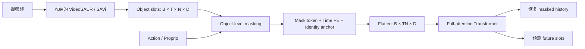
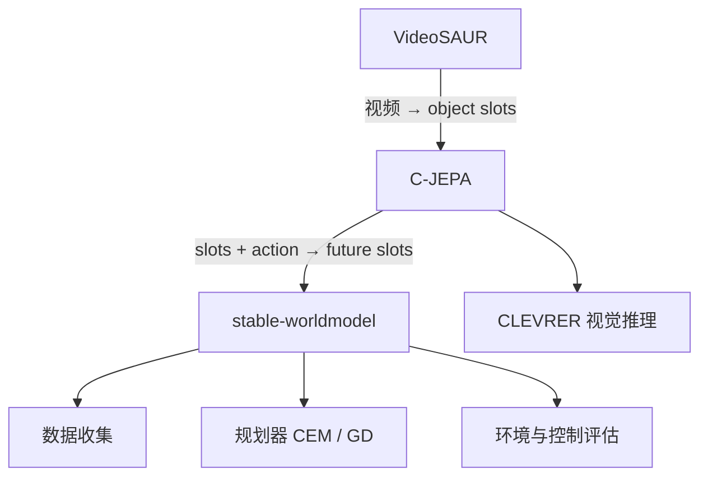

# C-JEPA 学习文档

> 项目：Causal-JEPA: Learning World Models through Object-Level Latent Interventions  
> 官方仓库：https://github.com/galilai-group/cjepa  
> 论文：https://arxiv.org/abs/2602.11389  
> 本地研究版本：`412337d`  
> 整理日期：2026-08-08

## 1. 一句话理解

C-JEPA 是一个在对象级潜在空间（object-level latent space）中预测未来的世界模型。它在训练时故意遮住部分对象的运动历史，迫使模型根据其他对象、动作和环境状态，推断被遮住对象的状态变化，从而学习对象之间的交互关系。

它的核心组合是：

```text
冻结的对象编码器（VideoSAUR / SAVi）
                    +
对象级 masked latent predictor（Transformer）
                    +
动作规划与评估（stable-worldmodel）
```

## 2. 它想解决什么问题

普通视频世界模型通常把图像切成大量 patch token，然后预测未来 patch 的表示。这种方法有两个问题：

1. patch 并不天然对应独立对象，一个物体可能横跨多个 patch；
2. 模型可能通过局部运动外推完成预测，而没有真正理解对象之间的碰撞、推动和约束关系。

例如，当蓝球连续向右移动时，模型可能只学习“继续向右”，而不需要理解旁边的红球是否会撞击它。

C-JEPA 的思路是先把场景表示成少量对象 slots，然后遮住某个对象的大部分历史轨迹。这样，模型不能只依赖该对象自身的连续运动，而需要观察其他对象如何运动，才能恢复它的状态。

## 3. 从视频到对象 Slots

给定一段视频帧：

\[
x_0,x_1,\ldots,x_T
\]

冻结的 VideoSAUR 或 SAVi 编码器将每帧转换成一组 slots：

\[
E(x_t)=S_t=[s_t^1,s_t^2,\ldots,s_t^N],\qquad s_t^i\in\mathbb{R}^D
\]

其中：

- \(N\) 是每帧的 slot 数量；
- \(D\) 是每个 slot 的特征维度；
- 每个 slot 理想情况下表示一个对象或场景组成部分；
- slots 是学习得到的对象表示，不保证天然带有人工定义的类别标签。

当前仓库的典型配置：

| 任务 | Slot 数量 | Slot 维度 | 历史帧 | 预测帧 |
|---|---:|---:|---:|---:|
| CLEVRER | 7 | 128 | 3 | 1 |
| Push-T | 4 | 128 | 5 | 3 |

相关配置：

- [`configs/config_train_causal_clevrer_slot.yaml`](../codebases/cjepa/configs/config_train_causal_clevrer_slot.yaml)
- [`configs/config_train_causal_pusht_slot.yaml`](../codebases/cjepa/configs/config_train_causal_pusht_slot.yaml)

## 4. Object-Level Masking

假设视频中有三个对象 A、B、C，模型获得三帧历史并预测一帧未来：

| 对象 | \(t_0\) | \(t_1\) | \(t_2\) | 未来 \(t_3\) |
|---|---|---|---|---|
| A | 可见，作为 identity anchor | 遮住 | 遮住 | 待预测 |
| B | 可见 | 可见 | 可见 | 待预测 |
| C | 可见 | 可见 | 可见 | 待预测 |

所有对象在第一帧都可见。第一帧的 slot 提供对象身份锚点，让模型知道后续要预测的是哪个对象。

对于被遮住的位置，模型输入的不是原始 slot，而是一个 query：

\[
q_{t,i}=m+e_t+\phi(s_0^i)
\]

其中：

- \(m\)：可学习的 mask token；
- \(e_t\)：时间位置编码；
- \(\phi(s_0^i)\)：由第一帧 slot 生成的 identity encoding；
- \(q_{t,i}\)：询问“对象 \(i\) 在时间 \(t\) 应该处于什么状态”。

实现位置：[`src/cjepa_predictor.py`](../codebases/cjepa/src/cjepa_predictor.py)。

## 5. 为什么称为 Causal-JEPA

这里的 “Causal” 不是指自回归模型中的 causal attention。仓库使用的是 non-causal full-attention Transformer，所有输入 token 可以互相注意。

它的因果含义来自训练干预：

1. 保留对象 A 的初始身份；
2. 移除 A 后续的 latent trajectory；
3. 保留 B、C 等对象的历史，以及动作等辅助信息；
4. 要求模型推断 A 被移除的状态。

这类似于在对象级 latent variable 上进行干预。为了恢复 A，模型必须学习其他对象与 A 之间的关系，例如碰撞、推动和约束。

更严谨地说，C-JEPA 引入的是 causal inductive bias 和 counterfactual-like effect；它并不等于已经从观察数据中识别出完整且可证明的结构因果模型。

## 6. Predictor 的结构

模型首先构造一个形状为：

\[
B\times T\times N\times D
\]

的 token 网格，然后将时间与对象两个维度展平：

\[
B\times(TN)\times D
\]

展平后的序列进入 Transformer Encoder：



核心类：

- `NonCausalTransformer`：标准 full-attention Transformer Encoder；
- `MaskedSlotPredictor`：构造 mask query、执行预测；
- `MaskedSlot_AP_Predictor`：显式处理 action/proprio 节点的变体。

## 7. 训练目标

C-JEPA 不直接预测未来像素，而是在 frozen encoder 产生的 latent space 中预测目标 slots。

总损失为：

\[
\mathcal{L}=\mathcal{L}_{\text{masked-history}}+\mathcal{L}_{\text{future}}
\]

其中：

\[
\mathcal{L}_{\text{masked-history}}
=\operatorname{MSE}(\hat S_{\text{masked history}},S_{\text{masked history}})
\]

\[
\mathcal{L}_{\text{future}}
=\operatorname{MSE}(\hat S_{\text{future}},S_{\text{future}})
\]

目标表示会执行 `detach()`，因此 target 不参与反向传播。由于 object encoder 本身被冻结，训练重点落在 predictor 上。

CLEVRER 的简洁损失实现位于：

- [`src/train/train_causalwm_from_clevrer_slot.py`](../codebases/cjepa/src/train/train_causalwm_from_clevrer_slot.py)

## 8. 训练与推理的区别

训练阶段：

- 部分对象从 \(t_1\) 开始被遮住；
- 模型恢复被遮住的历史；
- 模型同时预测所有对象的未来。

推理阶段：

- 所有真实历史 slots 都可见；
- 未来位置使用 mask query；
- 模型只返回未来 slots。

因此，训练中的 object masking 是一种正则化和学习信号，不代表部署时也必须丢弃历史观测。

## 9. Push-T 中的动作条件

在机器人控制任务中，模型除了 object slots，还接收：

- action embedding；
- proprioception embedding。

当前实现将这些向量复制到每个 object slot，并沿特征维拼接：

\[
z_t^i=[s_t^i; p_t; a_t]
\]

其中 \(p_t\) 是 proprioception，\(a_t\) 是 action。

规划时会生成多组候选动作序列，使用 C-JEPA rollout 对应的未来 slots，再选择预测结果最接近目标的动作。CEM、GD 等求解器来自 stable-worldmodel。

Push-T 训练入口：

- [`src/train/train_causalwm_from_pusht_slot.py`](../codebases/cjepa/src/train/train_causalwm_from_pusht_slot.py)

## 10. 三个代码库之间的关系



- VideoSAUR：负责从视频中发现并跟踪对象表示；
- C-JEPA：负责学习对象之间的动力学与交互；
- stable-worldmodel：提供数据、环境、规划器和统一评估接口。

## 11. 实验任务

### CLEVRER

CLEVRER 是带有物理交互和问题回答标注的视频数据集。C-JEPA rollout 出未来 slots 后，再使用 ALOE 等 VQA 模型回答：

- 描述性问题；
- 预测性问题；
- 解释性问题；
- 反事实问题。

论文最关注 object masking 是否改善交互推理，尤其是 counterfactual reasoning。

### Push-T

Push-T 是视觉机器人控制任务。智能体要推动一个 T 形物体到目标位置。C-JEPA 作为 latent world model，用候选动作预测物体未来状态，供规划器选择动作。

## 12. 建议的代码阅读顺序

1. 阅读 [`README.md`](../codebases/cjepa/README.md)，了解数据、checkpoint 和官方命令；
2. 阅读 [`src/cjepa_predictor.py`](../codebases/cjepa/src/cjepa_predictor.py)，理解 masking 与 query 构造；
3. 阅读 CLEVRER 的 [`compute_loss`](../codebases/cjepa/src/train/train_causalwm_from_clevrer_slot.py)，掌握最简训练闭环；
4. 阅读 Push-T 训练入口，理解 action/proprio 如何接入；
5. 阅读 [`src/world_models/dinowm_causal.py`](../codebases/cjepa/src/world_models/dinowm_causal.py)，理解规划时如何替换候选动作并 rollout；
6. 最后阅读 `src/plan/`，理解 CEM/GD 规划流程。

## 13. 当前代码需要留意的地方

这是一个偏研究性质的仓库，还不是即装即用的成熟库：

- 仓库内 vendored 了 VideoSAUR、SlotFormer 等第三方代码；
- 部分配置包含需要手工修改的本地数据路径；
- README 注明项目仍在适配新版 stable-worldmodel 和 stable-pretraining；
- `get_mask_indices()` 每次使用相同 seed 初始化随机数生成器；
- 当前 mask indices 在整个 batch 内共享，而不是每个样本独立采样；
- slot 本身可能存在排列不确定性，Push-T 代码提供了可选 Hungarian matching。

在修改模型前，应先区分“论文设计”与“当前仓库工程实现”，避免把某个实现细节误认为方法必须如此。

## 14. 推荐的入门实验

### 实验一：Mask 数量消融

修改：

```yaml
num_masked_slots: 0
num_masked_slots: 1
num_masked_slots: 2
```

比较：

- future latent MSE；
- masked-history MSE；
- CLEVRER counterfactual accuracy；
- Push-T success rate。

这是理解 C-JEPA 核心贡献最直接的实验。

### 实验二：随机 Mask 策略

对比：

- 每次 forward 固定 mask indices；
- 每个 batch 随机 mask；
- 每个 sample 独立随机 mask；
- 根据对象交互强度选择 mask。

### 实验三：Patch JEPA 与 Object JEPA

在相同视频和预测长度下比较：

- token 数量；
- GPU 显存；
- rollout 速度；
- 控制成功率；
- 对象碰撞与反事实问题表现。

### 实验四：Identity Anchor 消融

移除或改变 \(\phi(s_0^i)\)，观察模型是否还能维持对象身份、避免 slot swapping。

## 15. 学习检查清单

- [ ] 能解释 JEPA 为什么预测 latent 而不是像素；
- [ ] 能说明 object slot 与 ViT patch token 的差别；
- [ ] 能画出 C-JEPA 的 object masking 表格；
- [ ] 能解释 identity anchor 的作用；
- [ ] 能说明为什么 full attention 不等于未来信息泄漏；
- [ ] 能写出 masked-history 与 future loss；
- [ ] 能解释 causal inductive bias 与严格因果识别的区别；
- [ ] 能找到 CLEVRER 和 Push-T 的训练入口；
- [ ] 能设计一个 `num_masked_slots` 消融实验。

## 16. 核心总结

C-JEPA 的创新不是使用一个特别复杂的 Transformer，而是改变世界模型看到信息的方式：

> 将视频压缩成对象，把某个对象的运动轨迹从历史中拿走，再要求模型依靠其他对象和动作恢复它。

这种训练方式减少了依赖单对象运动外推的 shortcut，并把模型的注意力引向对象之间的关系。对于需要理解碰撞、推动、约束和反事实变化的世界模型，这是一个简单但很有研究价值的 inductive bias。
