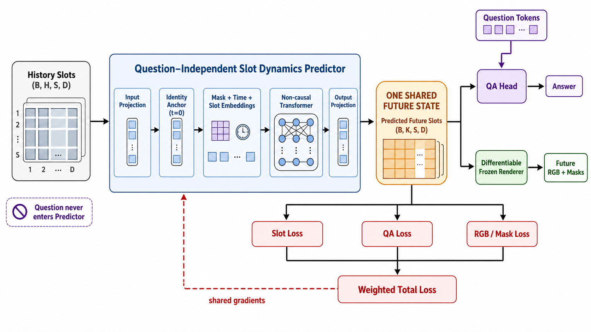

# OneState MVP design



## Claim tested by this version

The MVP tests one narrow claim: a single question-independent predicted object
state can be read by both a QA head and a visual decoder, while both objective
functions update the same dynamics predictor.

This is an architectural and gradient-flow MVP. It is not yet a CLEVRER result.

## Tensor notation

`S` and `D` are separate axes; there is no single `SD` variable.

| Symbol | Meaning | MVP value |
| --- | --- | ---: |
| `B` | Number of independent video clips in a mini-batch | 16 in the smoke config |
| `H` | Number of observed history frames per clip | 3 |
| `K` | Number of future frames to predict | 2 |
| `S` | Number of object slots in every frame | 4 synthetic; 7 for C-JEPA SAVi |
| `D` | Feature dimension of one object slot | 16 synthetic; 128 for C-JEPA SAVi |

The predictor input therefore has shape `(B, H, S, D)`, and its shared future
state has shape `(B, K, S, D)`. `H` is not one frame: it is the number of frames
in the observed history window.

## End-to-end training sample

For real video, a sample is constructed from a continuous clip of `H + K`
frames. A frozen object-centric encoder processes the complete clip:

```text
RGB frames x[0:H+K]
    -> frozen SAVi encoder E
    -> slots z[0:H+K]

history input:       z[0:H]
future slot target:  stop_gradient(z[H:H+K])
future RGB target:   x[H:H+K]
```

The predictor sees only `z[0:H]`. The target slots are not guessed or manually
written: they are extracted from the actual future frames by the same frozen
encoder. The future frames are used only to construct training targets and are
not given to the predictor.

The current synthetic dataset follows exactly the same interface, but computes
the states analytically from known position and velocity instead of running a
visual encoder.

## Future-slot supervision

Let `z*` be target slots extracted from real future frames and `z_hat` be slots
predicted from history. With aligned object identities, the latent loss is:

```text
L_slot = mean((z_hat[b, t, s, :] - stop_gradient(z*[b, t, s, :]))^2)
```

`stop_gradient` prevents the target encoder branch from changing to make the
loss artificially easier. Gradients update the predictor through `z_hat` only.

Slot order requires explicit care. Slot Attention outputs are set-like, so slot
index `s` is not automatically a semantic identity in every implementation:

1. The synthetic MVP fixes each object's slot index for the entire sequence.
2. Recurrent SAVi normally propagates slots through time, so continuous
   extraction of all `H + K` frames should preserve identity better than
   encoding history and future as separate clips.
3. Before using direct slot-wise MSE on CLEVRER, decoded masks and adjacent-frame
   slot similarity must verify that identities remain stable.
4. If identities permute, target slots must first be tracked with Hungarian
   matching. Matching should link each target to the previous target or the last
   history anchor across the whole horizon, rather than independently matching
   every frame to the prediction, which could hide identity switches.

RGB and mask supervision does not require a hand-authored target slot. The
predicted slots pass through the frozen decoder, and the output is compared with
the actual future RGB frames and masks. Freezing decoder parameters does not
mean detaching its input: gradients must still pass through the decoder into
the predicted slots and shared predictor.

## Invariants

1. `SlotDynamicsPredictor` accepts history slots and an optional masking pattern;
   it never accepts question tokens.
2. The predictor performs one differentiable rollout and returns one
   `future_slots` tensor.
3. The QA head and renderer consume the exact same tensor.
4. Target future slots are detached supervision. Predicted future slots are not.
5. A frozen decoder may freeze its parameters, but its forward pass must not run
   under `torch.no_grad()` when decoding predictions.
6. Object identity is fixed across the synthetic horizon. Real SAVi slots will
   require explicit matching checks before using slot-wise losses.

## Current synthetic task

Each scene contains four persistent object slots with position, color, scale,
velocity, and identity dimensions. The objects move linearly. Questions select
the fastest, final rightmost, or final topmost object. A parameter-free Gaussian
renderer converts slots into RGB frames and masks.

The renderer is intentionally simple: it proves that observable-space loss can
flow through a frozen visual readout into the shared predictor. It will later be
replaced by the pretrained `StoSAVi.decode` adapter.

## Experiments

- `dyn_qa`: dynamics + masked-history + QA supervision.
- `dyn_gen`: dynamics + masked-history + RGB/mask supervision.
- `unified`: all of the above on one predictor.

The first real-data milestone will preserve this interface and replace only the
dataset and decoder:

```text
CLEVRER video -> frozen SAVi encoder -> history slots
history slots -> shared predictor -> future slots
future slots + question -> ALOE-style QA readout
future slots -> frozen SAVi decoder -> RGB/masks
```

## Exit criteria before CLEVRER

- Unit tests prove question-independent rollout.
- QA-only loss creates non-zero gradients on predictor parameters.
- generation-only loss creates non-zero gradients on predictor parameters.
- smoke training decreases joint loss and saves a reloadable checkpoint.
- all three ablation configurations run through the same training entry point.
